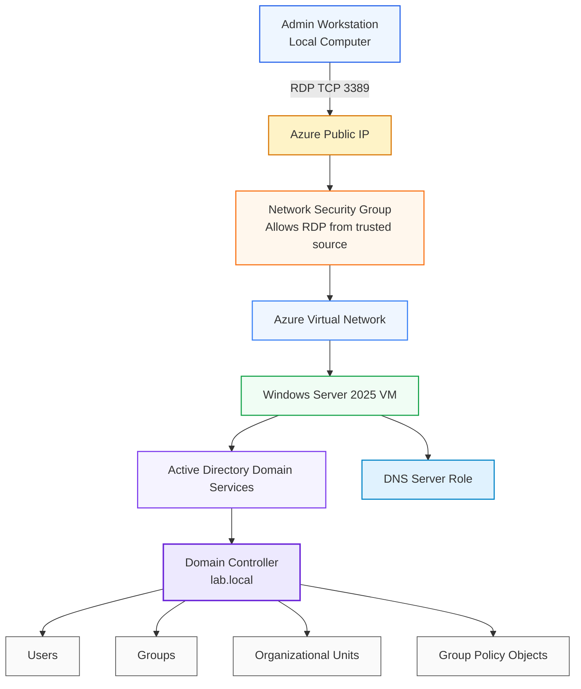
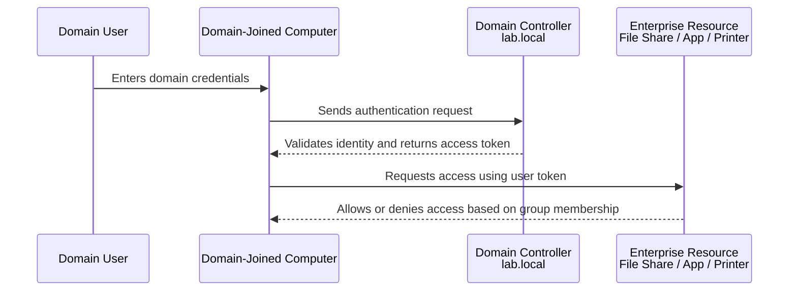
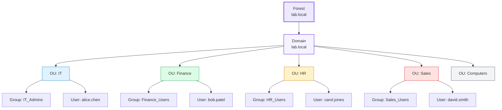
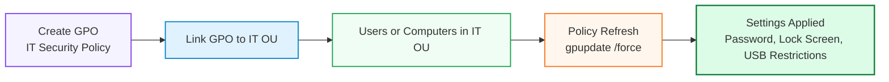
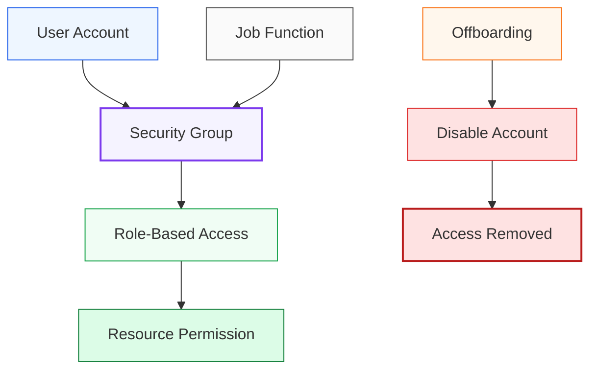

# 🌳 Active Directory Domain Controller in Azure


🎥 **Video walkthrough:** [AD DC in Azure](https://www.loom.com/share/1508146bac41474aa19bc7be9d2b6e5e)
--

## Executive Summary

This lab demonstrates how to deploy and configure a **Windows Server 2025 Active Directory Domain Controller** inside a Microsoft Azure virtual machine.

The purpose of this project was to build a foundational enterprise identity environment by installing **Active Directory Domain Services**, promoting a Windows Server VM to a domain controller, creating a new forest and domain, building an Organizational Unit structure, creating users and security groups, configuring Group Policy Objects, and practicing common help desk and systems administration tasks.

Active Directory remains one of the most important technologies in enterprise IT. Even in cloud-first environments, many organizations still rely on traditional Active Directory for authentication, authorization, domain-joined devices, Group Policy, and hybrid identity integration with Microsoft Entra ID.

🥽 In this lab, I configured:

- Azure-hosted Windows Server virtual machine
- Active Directory Domain Services
- New AD forest and domain: `lab.local`
- DNS integration for the domain controller
- Organizational Units for departments and computers
- Security groups for role-based access control
- Domain user accounts
- Group Policy Objects
- Password and security policies
- Common account lifecycle tasks
- PowerShell-based AD administration commands

This project strengthens my foundation in **systems administration, identity and access management, enterprise Windows infrastructure, and cloud-hosted lab environments**.

---

## Certification and Career Alignment

| Area | Relevance |
|---|---|
| CompTIA Network+ | DNS, client-server communication, domain networking, IP configuration |
| CompTIA Security+ | Identity, access control, least privilege, authentication, account lifecycle management |
| Microsoft Azure Administrator | Azure VM deployment, compute management, remote access, cloud-hosted Windows Server |
| Systems Administrator | Domain controller deployment, OU design, user management, GPO configuration |
| Cloud Engineer | Understanding hybrid identity foundations and how on-prem AD concepts connect to Entra ID |
| Security Analyst | Understanding why Active Directory is a high-value target and how access is structured |
| Help Desk / IT Support | Password resets, account unlocks, user provisioning, group membership changes |

---

## 🫆 Business Problem

Organizations need a centralized way to manage users, computers, access permissions, and security policies.

Active Directory solves one of the most important questions in enterprise IT:

> Who is allowed to access what?

In a Windows-based organization, Active Directory controls:

- User authentication
- Group membership
- Computer domain membership
- Access to shared resources
- Password and account policies
- Security settings through Group Policy
- Centralized identity lifecycle management

When a new employee joins an organization, IT can create one domain account, add the user to the correct groups, and automatically grant access based on their role. When an employee leaves, disabling one account can remove access across multiple systems.

This lab simulates that enterprise identity foundation by building a domain controller in Azure and managing users, groups, OUs, and policies in a controlled environment.

---

## 🛠️ Tools and Environment

| Component | Details |
|---|---|
| Cloud Platform | Microsoft Azure |
| Compute | Azure Virtual Machine |
| Operating System | Windows Server 2025 Datacenter |
| Server Role | Active Directory Domain Services |
| Domain | `lab.local` |
| NetBIOS Name | `LAB` |
| Remote Access | Remote Desktop Protocol, TCP 3389 |
| Management Tools | Server Manager, ADUC, Group Policy Management Console, PowerShell |
| PowerShell Modules | ADDSDeployment, Active Directory cmdlets |
| Estimated Time | 3–5 hours |
| Estimated Cost | $0 when using free credits/evaluation licensing responsibly |

> Cost note: Azure VMs may consume credits while running. Stop the VM when it is not being used to reduce compute charges.

---

## 📐 Repository Structure

```text
active-directory-azure-domain-controller-lab/
│
├── README.md
├── diagrams/
│   ├── active-directory-azure-architecture.png
│   ├── domain-controller-traffic-flow.png
│   └── active-directory-logical-structure.png
│
├── screenshots/
│   ├── 01-azure-vm-overview.png
│   ├── 02-server-manager-ad-ds-installed.png
│   ├── 03-promote-domain-controller.png
│   ├── 04-domain-created-lab-local.png
│   ├── 05-active-directory-users-and-computers.png
│   ├── 06-organizational-units.png
│   ├── 07-security-groups.png
│   ├── 08-domain-users.png
│   ├── 09-group-policy-management.png
│   ├── 10-it-security-policy-gpo.png
│   └── 11-powershell-validation.png
│
├── scripts/
│   ├── install-ad-ds.ps1
│   ├── promote-domain-controller.ps1
│   ├── create-ou-structure.ps1
│   ├── create-users-and-groups.ps1
│   └── common-helpdesk-tasks.ps1
│
└── notes/
    ├── troubleshooting-notes.md
    ├── lessons-learned.md
    └── security-considerations.md
```

> Security note: Do not upload administrator passwords, real usernames, real employer naming conventions, public IPs, RDP files, secrets, tokens, or screenshots showing sensitive subscription details.

---

# Architecture Overview

The diagram below shows the high-level architecture for this lab. A local administrator connects to an Azure-hosted Windows Server VM using RDP. The VM is configured as a domain controller for the internal domain `lab.local`.



## Identity and Access Management Flow

The diagram below shows how Active Directory supports authentication and authorization.



## Active Directory Logical Structure

This lab used a simple department-based OU structure to model a small organization.



---

# Core Concepts

## What Is Active Directory?

Active Directory is Microsoft’s directory service for managing users, computers, groups, permissions, and policies in a Windows domain environment.

It acts as a centralized identity system that allows administrators to control who can log in, what systems they can access, and what policies apply to them.

## What Is a Domain Controller?

A Domain Controller is a server that runs Active Directory Domain Services. It authenticates users, stores directory objects, enforces policies, and provides identity services for the domain.

In this lab, the Windows Server 2025 Azure VM was promoted to a domain controller for the domain `lab.local`.

## What Is a Forest?

A forest is the top-level security and administrative boundary in Active Directory. It contains one or more domains.

In this lab, I created a new forest with a single domain named `lab.local`.

## What Is a Domain?

A domain is a logical boundary inside an Active Directory forest. Users, groups, computers, and policies are managed within the domain.

## What Is an Organizational Unit?

An Organizational Unit, or OU, is a container used to organize Active Directory objects such as users, groups, and computers.

OUs are also important because Group Policy Objects can be linked to them, allowing administrators to apply specific settings to specific departments, locations, or device groups.

## What Is a Security Group?

A security group is used to assign permissions based on role or job function.

Instead of granting access directly to individual users, administrators add users to groups and assign permissions to those groups. This supports role-based access control and the principle of least privilege.

## What Is Group Policy?

Group Policy allows administrators to centrally enforce configuration settings across users and computers in a domain.

Examples include password policies, lock screen timers, removable storage restrictions, security baselines, and other enterprise controls.

---

# 🥽 Lab Objectives

By completing this lab, I demonstrated the ability to:

- Deploy a Windows Server VM in Azure
- Connect to a cloud-hosted server using RDP
- Install Active Directory Domain Services
- Install Group Policy Management Console
- Promote a server to a domain controller
- Create a new AD forest and domain
- Configure DNS as part of domain controller promotion
- Create Organizational Units
- Create domain users
- Create security groups
- Assign users to groups
- Configure Group Policy settings
- Perform common account management tasks with PowerShell
- Document the environment with diagrams, screenshots, scripts, and troubleshooting notes

---

# Step 1 — Deploy the Azure Virtual Machine

## Objective

Create a Windows Server VM in Azure to host Active Directory Domain Services.

## Azure VM Configuration

| Setting | Value | Purpose |
|---|---|---|
| Region | East US | Common low-cost region with broad VM availability |
| Image | Windows Server 2025 Datacenter Gen2 | Server OS used for the domain controller |
| Size | Standard B2s | 2 vCPU and 4 GB RAM, suitable for a small AD lab |
| Authentication | Password | Used for initial administrative access |
| Public Inbound Port | RDP TCP 3389 | Required for remote desktop access |
| OS Disk | Standard SSD | Adequate performance for lab environment |

## Screenshot Evidence


```text
screenshots/01-azure-vm-overview.png
```
> Azure virtual machine overview showing the Windows Server VM used for the Active Directory lab.

## Security Note

For a production environment, RDP should not be broadly exposed to the internet. Better options include:

- Restricting RDP to a trusted public IP
- Using Azure Bastion
- Using VPN access
- Enforcing strong authentication
- Disabling public management access where possible

For this lab, RDP was used for controlled administrative access.

---

# Step 2 — Install Active Directory Domain Services

## Objective

Install the Active Directory Domain Services role on the Windows Server VM.

## GUI Method

1. RDP into the Windows Server VM.
2. Open Server Manager.
3. Select **Manage > Add Roles and Features**.
4. Choose **Role-based or feature-based installation**.
5. Select the local server.
6. Select **Active Directory Domain Services**.
7. Add required management features when prompted.
8. Complete the installation wizard.

## PowerShell Method

```powershell
Install-WindowsFeature -Name AD-Domain-Services -IncludeManagementTools
```

## Install Group Policy Management Console

```powershell
Install-WindowsFeature -Name GPMC
```

## Screenshot Evidence


```text
screenshots/02-server-manager-ad-ds-installed.png
```
> Server Manager showing Active Directory Domain Services installed on the Windows Server VM.

## Findings

Installing the AD DS role prepares the server to become a domain controller, but it does not create a domain. The server must still be promoted to a domain controller before it can provide directory services.

---

# Step 3 — Promote the Server to a Domain Controller

## Objective

Create a new Active Directory forest and promote the Windows Server VM to a domain controller.

## Configuration Used

| Setting | Value |
|---|---|
| Deployment Type | Add a new forest |
| Root Domain Name | `lab.local` |
| NetBIOS Name | `LAB` |
| DNS | Installed with domain controller |
| DSRM Password | Created during promotion |

## GUI Method

1. In Server Manager, click the yellow notification flag.
2. Select **Promote this server to a domain controller**.
3. Choose **Add a new forest**.
4. Set the root domain name to:

```text
lab.local
```

5. Set the Directory Services Restore Mode password.
6. Accept DNS and NetBIOS defaults.
7. Complete prerequisites check.
8. Click **Install**.
9. Allow the server to restart.

## PowerShell Method

```powershell
Import-Module ADDSDeployment

Install-ADDSForest `
  -DomainName 'lab.local' `
  -DomainNetBiosName 'LAB' `
  -InstallDns:$true `
  -SafeModeAdministratorPassword (ConvertTo-SecureString 'YourDSRMPassword!' -AsPlainText -Force) `
  -Force:$true
```

> Replace `YourDSRMPassword!` with a secure lab password. Do not upload real passwords to GitHub.

## Screenshot Evidence


```text
screenshots/03-promote-domain-controller.png
screenshots/04-domain-created-lab-local.png
```
> Server Manager domain controller promotion workflow for the new forest.

> Domain controller successfully created for the `lab.local` domain.

## Findings

After promotion, the server became the authoritative domain controller for `lab.local`. It now provides authentication, directory services, and DNS for the lab domain.

---

# Step 4 — Build the Organizational Unit Structure

## Objective

Create a simple department-based OU structure to organize users, groups, and computers.

## OUs Created

| Organizational Unit | Purpose |
|---|---|
| IT | IT users and administrative security group |
| Finance | Finance users and security group |
| HR | HR users and security group |
| Sales | Sales users and security group |
| Computers | Domain-joined workstation objects |

## PowerShell Commands

```powershell
New-ADOrganizationalUnit -Name "IT"        -Path "DC=lab,DC=local"
New-ADOrganizationalUnit -Name "Finance"   -Path "DC=lab,DC=local"
New-ADOrganizationalUnit -Name "HR"        -Path "DC=lab,DC=local"
New-ADOrganizationalUnit -Name "Sales"     -Path "DC=lab,DC=local"
New-ADOrganizationalUnit -Name "Computers" -Path "DC=lab,DC=local"
```

## Screenshot Evidence


```text
screenshots/06-organizational-units.png
```

> Active Directory Users and Computers showing the department-based OU structure.

## Findings

Creating separate OUs allows policies and administrative controls to be applied based on department or device type. This reflects how enterprises organize Active Directory objects at scale.

---

# Step 5 — Create Security Groups

## Objective

Create department-based security groups to support role-based access control.

## Security Groups Created

| Group | OU | Purpose |
|---|---|---|
| `IT_Admins` | IT | Administrative users |
| `Finance_Users` | Finance | Finance department access |
| `HR_Users` | HR | HR department access |
| `Sales_Users` | Sales | Sales department access |

## PowerShell Commands

```powershell
New-ADGroup -Name "IT_Admins"     -GroupScope Global -GroupCategory Security -Path "OU=IT,DC=lab,DC=local"
New-ADGroup -Name "Finance_Users" -GroupScope Global -GroupCategory Security -Path "OU=Finance,DC=lab,DC=local"
New-ADGroup -Name "HR_Users"      -GroupScope Global -GroupCategory Security -Path "OU=HR,DC=lab,DC=local"
New-ADGroup -Name "Sales_Users"   -GroupScope Global -GroupCategory Security -Path "OU=Sales,DC=lab,DC=local"
```

## Screenshot Evidence


```text
screenshots/07-security-groups.png
```
> Department-based security groups created in Active Directory Users and Computers.

## Findings

Using groups instead of assigning permissions directly to users supports scalability, cleaner access management, and the principle of least privilege.

---

# Step 6 — Create Domain User Accounts

## Objective

Create test domain users and place each user into the correct department OU and security group.

## Users Created

| User | Username | OU | Group Membership |
|---|---|---|---|
| Alice Chen | `alice.chen` | IT | `IT_Admins` |
| Bob Patel | `bob.patel` | Finance | `Finance_Users` |
| Carol Jones | `carol.jones` | HR | `HR_Users` |
| David Smith | `david.smith` | Sales | `Sales_Users` |

## PowerShell Commands

```powershell
# Define lab password variable
$password = ConvertTo-SecureString "Welcome@2026!" -AsPlainText -Force

# Create users
New-ADUser -Name "alice.chen" -GivenName "Alice" -Surname "Chen" `
  -SamAccountName "alice.chen" -UserPrincipalName "alice.chen@lab.local" `
  -Path "OU=IT,DC=lab,DC=local" -AccountPassword $password -Enabled $true

New-ADUser -Name "bob.patel" -GivenName "Bob" -Surname "Patel" `
  -SamAccountName "bob.patel" -UserPrincipalName "bob.patel@lab.local" `
  -Path "OU=Finance,DC=lab,DC=local" -AccountPassword $password -Enabled $true

New-ADUser -Name "carol.jones" -GivenName "Carol" -Surname "Jones" `
  -SamAccountName "carol.jones" -UserPrincipalName "carol.jones@lab.local" `
  -Path "OU=HR,DC=lab,DC=local" -AccountPassword $password -Enabled $true

New-ADUser -Name "david.smith" -GivenName "David" -Surname "Smith" `
  -SamAccountName "david.smith" -UserPrincipalName "david.smith@lab.local" `
  -Path "OU=Sales,DC=lab,DC=local" -AccountPassword $password -Enabled $true

# Add users to groups
Add-ADGroupMember -Identity "IT_Admins"     -Members "alice.chen"
Add-ADGroupMember -Identity "Finance_Users" -Members "bob.patel"
Add-ADGroupMember -Identity "HR_Users"      -Members "carol.jones"
Add-ADGroupMember -Identity "Sales_Users"   -Members "david.smith"
```

> GitHub safety note: For public repositories, avoid publishing reusable passwords. Replace passwords with placeholders or note that lab-only credentials were used.

## Screenshot Evidence


```text
screenshots/08-domain-users.png
```

> Domain user accounts created and organized by department in Active Directory.

## Findings

Each user account was created with a consistent naming convention and assigned to the appropriate department group. This simulates a basic enterprise onboarding workflow.

---

# Step 7 — Configure Group Policy

## Objective

Create and configure a Group Policy Object to enforce security settings for the IT OU.

## GPO Created

| GPO Name | Linked OU | Purpose |
|---|---|---|
| IT Security Policy | IT | Apply security settings to IT users/computers |

## Configured Policy Settings

| Policy Path | Setting | Value | Purpose |
|---|---|---|---|
| Computer Configuration > Windows Settings > Security Settings > Account Policies > Password Policy | Minimum password length | 12 | Enforces stronger passwords |
| Computer Configuration > Windows Settings > Security Settings > Account Policies > Password Policy | Password must meet complexity requirements | Enabled | Requires password complexity |
| Computer Configuration > Windows Settings > Security Settings > Local Policies > Security Options | Interactive logon: Machine inactivity limit | 900 seconds | Auto-locks after 15 minutes |
| Computer Configuration > Administrative Templates > System > Removable Storage Access | All removable storage classes: Deny all access | Enabled | Helps reduce USB-based data exfiltration risk |

## GPO Enforcement Flow



## Screenshot Evidence


```text
screenshots/09-group-policy-management.png
screenshots/10-it-security-policy-gpo.png
```

> Group Policy Management Console showing the IT Security Policy linked to the IT OU.

> Configured security settings inside the IT Security Policy GPO.

## Findings

Group Policy allows administrators to enforce security and configuration settings from a central location. This is a core systems administration skill because it allows organizations to manage large numbers of users and machines consistently.

---

# Step 8 — Practice Common Help Desk and Sysadmin Tasks

## Objective

Perform common Active Directory account lifecycle tasks using PowerShell.

## Reset a User Password

```powershell
Set-ADAccountPassword -Identity "bob.patel" -Reset -NewPassword (ConvertTo-SecureString "NewPass@2026!" -AsPlainText -Force)
Set-ADUser -Identity "bob.patel" -ChangePasswordAtLogon $true
```

## Unlock a User Account

```powershell
Unlock-ADAccount -Identity "carol.jones"
```

## Disable a User Account

```powershell
Disable-ADAccount -Identity "david.smith"
```

## Find Disabled Accounts

```powershell
Search-ADAccount -AccountDisabled | Select-Object Name, SamAccountName
```

## Find Accounts Inactive for 90 Days

```powershell
$cutoff = (Get-Date).AddDays(-90)
Get-ADUser -Filter {LastLogonDate -lt $cutoff -and Enabled -eq $true} -Properties LastLogonDate | Select-Object Name, LastLogonDate
```

## Check Group Membership

```powershell
Get-ADPrincipalGroupMembership -Identity "alice.chen" | Select-Object Name
```

## Findings

These tasks represent common real-world help desk and systems administration workflows, including password resets, account unlocks, offboarding, disabled account review, inactive account reporting, and access verification.

---

# Validation Checklist

| Skill | Validation Method | Completed |
|---|---|---|
| Azure VM deployed | Confirm VM exists and is accessible in Azure Portal | ☐ |
| RDP connectivity | Successfully connected to the server using Remote Desktop | ☐ |
| AD DS installed | Confirm AD DS role installed in Server Manager | ☐ |
| GPMC installed | Confirm Group Policy Management appears in Server Manager tools | ☐ |
| Server promoted | Confirm domain controller exists for `lab.local` | ☐ |
| DNS installed | Confirm DNS role is present on the domain controller | ☐ |
| OUs created | Confirm IT, Finance, HR, Sales, and Computers OUs exist | ☐ |
| Groups created | Confirm department security groups exist | ☐ |
| Users created | Confirm test users exist in correct OUs | ☐ |
| Group membership configured | Confirm users belong to the proper security groups | ☐ |
| GPO configured | Confirm IT Security Policy is linked to IT OU | ☐ |
| PowerShell tasks tested | Run account management commands successfully | ☐ |
| Documentation completed | Screenshots, diagrams, commands, and findings added to GitHub | ☐ |

---

# Troubleshooting Notes

| Issue | Likely Cause | Fix |
|---|---|---|
| Cannot RDP into VM | RDP not allowed in NSG or VM firewall | Confirm TCP 3389 is allowed from trusted source IP |
| Copy/paste does not work in RDP | Clipboard redirection disabled | Enable Clipboard under Local Resources in the RDP client |
| ADUC not visible | AD DS management tools not installed | Install AD DS with `-IncludeManagementTools` |
| Group Policy Management missing | GPMC not installed | Run `Install-WindowsFeature -Name GPMC` |
| Domain promotion fails | DNS or prerequisite issue | Review prerequisite check results and event logs |
| PowerShell AD commands fail | Active Directory module not loaded or not installed | Run commands on the domain controller or install RSAT tools |
| User creation script prompts unexpectedly | Password variable was not defined first | Run the full script block together |
| GPO does not apply | Object is not in linked OU or policy has not refreshed | Move object to correct OU and run `gpupdate /force` |
| Password policy does not behave as expected | Domain password policy behavior differs from OU-linked policy expectations | Review Default Domain Policy and fine-grained password policy concepts |

---

# Security Considerations

Active Directory is one of the most targeted systems in enterprise environments because it controls identity and access.

Security lessons from this lab:

- Domain controllers should be treated as high-value assets.
- Administrative access should be limited and monitored.
- Users should receive access through groups, not direct assignments.
- Accounts should be disabled during offboarding instead of deleted immediately.
- Password and lockout policies should be centrally enforced.
- RDP access should be restricted and protected.
- Public cloud labs should avoid exposing management ports broadly.
- Screenshots and scripts should not reveal real secrets or sensitive details.

## Least Privilege Model



---

# Key Takeaways

1. Active Directory centralizes identity and access management in Windows enterprise environments.
2. A domain controller authenticates users and provides directory services for a domain.
3. OUs help organize users, groups, and computers for management and policy application.
4. Security groups support role-based access control and least privilege.
5. Group Policy allows administrators to enforce security settings centrally.
6. Azure provides a flexible environment for building cloud-hosted infrastructure labs.
7. PowerShell is essential for scalable Active Directory administration.
8. AD knowledge transfers directly into hybrid identity, Entra ID, cloud administration, and security roles.

---

# How This Applies to Cloud Engineering

This lab directly supports cloud engineering because cloud environments still depend heavily on identity, access, authentication, DNS, networking, and policy enforcement.

| Active Directory Skill | Cloud Engineering Connection |
|---|---|
| Domain controller deployment | Understanding identity infrastructure foundations |
| DNS integration | Troubleshooting name resolution in cloud networks |
| User and group management | Maps to IAM, RBAC, and Entra ID concepts |
| OU structure | Helps understand policy scoping and administrative boundaries |
| Group Policy | Connects to configuration management and endpoint security baselines |
| PowerShell administration | Supports automation and repeatable infrastructure operations |
| Account lifecycle management | Supports onboarding, offboarding, access reviews, and compliance |
| Azure-hosted lab | Builds comfort with cloud compute, RDP, NSGs, and VM management |

In hybrid environments, traditional Active Directory often integrates with Microsoft Entra ID using identity synchronization. Understanding AD gives cloud engineers a stronger foundation for managing users, access, conditional access, enterprise authentication, and secure infrastructure.

---

# Portfolio Summary

This project demonstrates hands-on experience deploying and configuring an Active Directory Domain Controller inside an Azure virtual machine.

I installed Active Directory Domain Services, promoted Windows Server 2025 to a domain controller, created the `lab.local` forest and domain, built a department-based OU structure, created users and security groups, configured Group Policy settings, and practiced common account lifecycle tasks using PowerShell.

This lab strengthened my skills in systems administration, identity and access management, Windows Server administration, Azure VM operations, PowerShell, Group Policy, and security-focused technical documentation.

---

# Next Improvements

Future improvements for this lab:

- Add a second Windows client VM and join it to `lab.local`
- Validate GPO application using `gpupdate /force` and `gpresult /r`
- Configure DNS forwarders
- Create shared folders and assign permissions using security groups
- Practice account lockout policy configuration
- Create a second domain controller for redundancy
- Explore Microsoft Entra ID Connect concepts
- Build a hybrid identity lab connecting AD concepts to cloud identity
- Automate more of the deployment with PowerShell or Terraform
